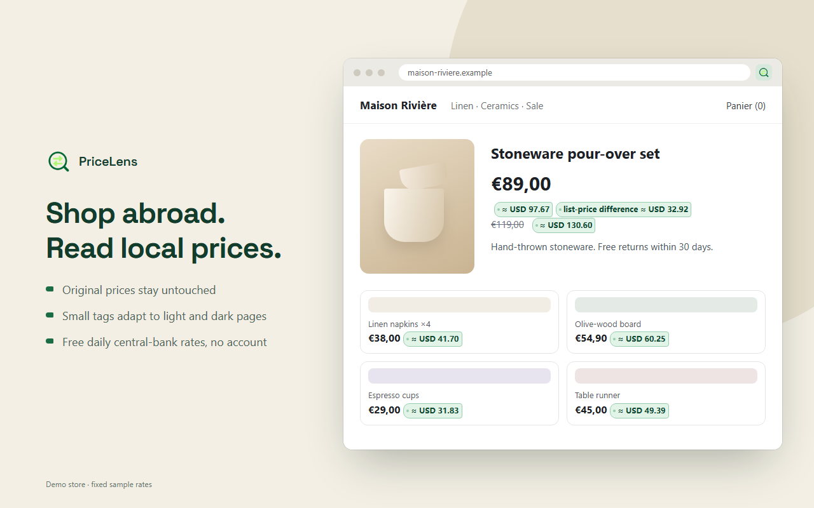

# PriceLens · 价译

**English** · [简体中文](README.zh-CN.md)

Shopping on a foreign site? PriceLens keeps the original price and shows it in your currency right beside it.

Works in Chrome and Edge. Everyday conversion needs no account and no API key. The interface is in Chinese for Chinese browsers (Simplified or Traditional) and in English for every other language.



## Install

Install from the [Chrome Web Store](https://chromewebstore.google.com/detail/iehjdehpgphmbkcpbpklheoofagjkbap); Edge can install from there too. Updates arrive automatically.

### Load the development version

1. Download this repository and unzip it somewhere permanent.
2. Open `chrome://extensions` (or `edge://extensions`) and turn on **Developer mode**.
3. Click **Load unpacked** and pick the **`extension`** folder.
4. Pin the toolbar icon, open the panel, choose **My currency**, then reload the page you are on.

After pulling an update, reload the extension on the extensions page, then reload open tabs.

## Using it

Open the panel, pick your currency and leave **Convert automatically** on. Original prices are never replaced; a small tag appears next to each one.

- **Details.** Click or tap a tag to see the source currency, rate date, rate source and estimate notes. Hovering shows a summary. With a keyboard, Tab onto one tag, move between tags with the arrow keys, open details with Enter or Space and close with Escape; prices do not each add a Tab stop.
- **Quick convert.** The ticket at the top of the panel shows the live rate for a currency pair. Type an amount to convert it.
- **Right-click.** For a price the page scan missed, select it and choose **Convert with PriceLens**. The result opens in a small dialog on the page. The selection is parsed locally and never sent anywhere.
- **Pause a site.** Turn on **Pause on this site** for sites you do not want converted.
- **Ambiguous symbols.** When `$` or `¥` could mean several currencies, PriceLens skips the price rather than guess. Under **Rates, recognition and AI** you can set **Currency on this site** (for example, `$` means CAD on a Canadian shop) or a **Page currency** for all sites. The site setting wins. Sites match by exact hostname, so `www.shop.ca` and `shop.ca` are separate.
- **Card fee.** Set your card's foreign transaction fee (for example 1.5%) to add it to cross-currency results, so they are closer to what you will be charged. Details say when a fee is included.
- **Starting prices.** Prices marked with `～` keep their "from" meaning and are never shown as a fixed price.
- **List-price difference.** Shows the list price minus the current price. It is on by default and can be turned off. It only appears when the page clearly marks a list price (schema.org `StrikethroughPrice` / `ListPrice`) or when a product shows exactly one struck-through price and one current price. Member, coupon and other conditional prices are ignored. It is not a guaranteed saving.

Rates are free daily central-bank reference rates, not live trading prices. The European Central Bank (ECB) is preferred. For currencies the ECB does not publish (such as TWD, VND, AED, SAR and RUB), PriceLens uses Frankfurter's blend of several central banks. The details for each conversion name the source of its rate. You can switch to Wise with your own API token. Every result is an estimate. It excludes fees unless you set one, and may differ from the amount you are finally charged.

## Optional AI currency recognition

Everything works without it. When the page alone cannot settle a currency, AI can read the text around that price and choose from a fixed list; if it is unsure, the price is skipped. Amounts, conversion and placement are always computed in your browser.

It needs your own [TypeSafe](https://console.typesafe.ai/) key, which may be billed. Read the notice in the panel before enabling it, and do not enable it on pages with private or sensitive content.

## Privacy and feedback

Page text is not uploaded by default. Keys and tokens stay on your device. See the [privacy policy](PRIVACY.md).

If an amount is wrong or a tag covers something, pause the site first, then report it in [Issues](https://github.com/JohnsonRan/PriceLens/issues). Hide personal information, and never post a key or token.

## Development

Requires Node.js 24 or newer. Tests use only the Node standard library, so there is nothing to `npm install`.

```sh
npm test
```

Every push and pull request runs the whole suite on GitHub Actions (Ubuntu with Playwright Chromium); any skipped test fails the run.

- The suite covers the product regressions listed in `package.json`. It uses fake credentials, mocked network and throwaway browser profiles, and never calls a paid service.
- DOM tests need Chromium or Chrome. Point `CHROME_BIN` at an executable, or they will look for an installed Playwright Chromium headless shell on Windows or Linux. Without a browser they are skipped explicitly. **Passing logic tests alone is not a browser verification.**
- Store listing text and images are in `store/` (see `store/LISTING.en.md`). `node store/render-screenshots.cjs` regenerates the screenshots and promo tiles from the real extension UI with mocked APIs and fixed sample rates; it needs full Chromium, like the MV3 smoke test. `powershell -NoProfile -File store/package.ps1` (Windows) renders the icons from `store/icon-source.png` and builds `dist/pricelens-<version>.zip` from a fixed file list.
- The real MV3 smoke test needs full Chromium (not the headless shell). Set `MV3_CHROME_BIN` or install Playwright Chromium. It loads the actual extension in a temporary profile with synthetic cached rates and blocked outbound requests. It checks worker messaging, saving settings, toggling pages, right-click results, the quick converter and Enter/Escape. It does not exercise live services, permission prompts or long-term worker eviction.
