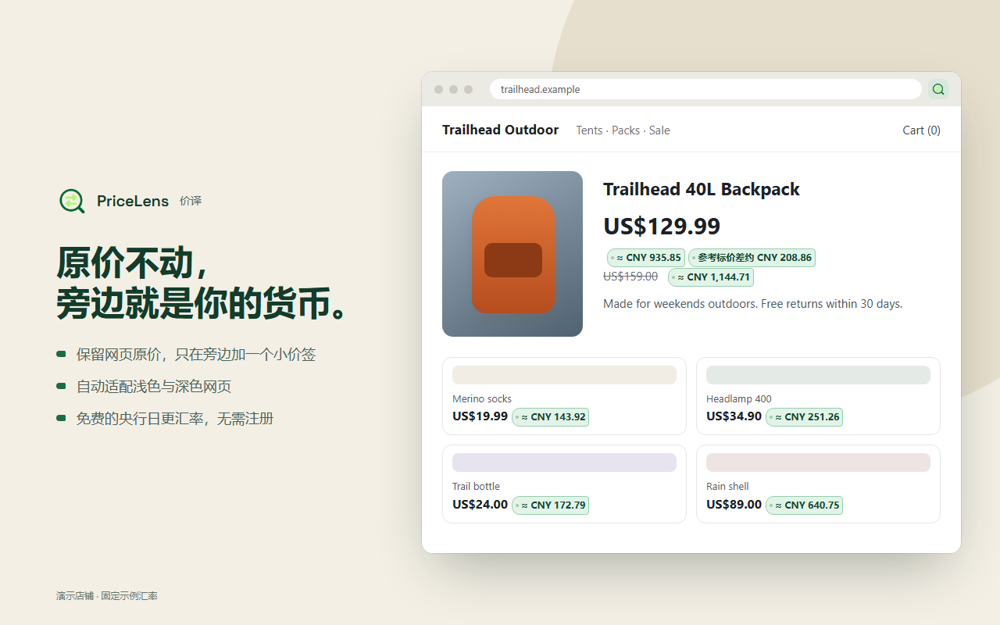

# 价译 · PriceLens

[English](README.md) · **简体中文**

逛海外网站时，保留原来的价格，在旁边显示你熟悉的货币。

适用于 Chrome / Edge。普通换算不需要注册，也不需要 API Key。中文浏览器（简体或繁体）显示中文界面，其他语言显示英文。



## 安装

从 [Chrome 应用商店](https://chromewebstore.google.com/detail/iehjdehpgphmbkcpbpklheoofagjkbap)安装（Edge 也可以从这里安装），更新会自动推送。

### 手动加载（开发版）

1. 下载本仓库并解压，放在以后不会移动的位置。
2. 打开 `chrome://extensions` 或 `edge://extensions`，开启「开发者模式」。
3. 选择「加载已解压的扩展程序」，选中其中的 **`extension`** 文件夹。
4. 固定工具栏图标，打开面板，选择「我的货币」，然后刷新当前网页。

更新代码后，先在扩展管理页重新加载扩展，再刷新已经打开的网页。

## 使用

打开面板，选择你的货币，保持「自动换算」开启。原价不会被替换，旁边会出现一个小价签。

- **查看详情**：点击或轻触价签，可以看到原币种、汇率日期、汇率来源和估算说明；鼠标悬停显示摘要。用键盘时，Tab 进入任意一个价签后，方向键切换，Enter 或空格打开详情，Escape 关闭；不会给每个价格都加一个 Tab 停靠点。商品链接里的价签只是文字，点击照常打开商品，悬停查看详情。
- **快速换算**：面板顶部的「兑换票」显示当前币种对的汇率，输入金额即可换算。
- **右键换算**：自动识别漏掉的价格，或在紧凑的商品卡片里放不下价签的价格，选中后右键选择「用价译换算」，结果显示在页面上的小对话框里。选中的文字只在本地解析，不会发送出去。
- **暂停网站**：不需要换算的网站，打开「暂停此网站」即可。
- **歧义符号**：`$`、`¥` 等可能代表多种货币时，价译会跳过而不去猜；除非网页自身数据（如商品数据）中只写明了一种货币。可以在「汇率、识别与 AI」里指定「此网站的原币种」（例如加拿大网站的 `$` 固定为 CAD），或指定对所有网站生效的「网页原币种」，网站设置优先。当前页面有这样被跳过的价格时，面板会显示数量，并可直接跳到网站设置。网站按完整域名匹配，`www.shop.ca` 和 `shop.ca` 需分别设置。
- **银行卡手续费**：填写你的银行卡外币手续费（例如 1.5%），跨币种结果会加上这笔费用，更接近实际扣款；详情里会注明已含手续费。
- **起价**：带「～」的起价会保留「起」的含义，不会当成固定价格。
- **参考标价差**：显示原价减现价，默认开启，可以关闭。只在两种明确情况下显示：页面结构化数据标出了原价（schema.org `StrikethroughPrice` / `ListPrice`），或同一商品恰好有一个划线价和一个现价。会员价、优惠券等有条件的价格不计算。它不代表实际一定能省下这么多。

默认使用免费的央行每日参考汇率，不是实时交易价：优先用欧洲央行（ECB）；ECB 不发布的币种（如新台币、越南盾、迪拉姆、里亚尔、卢布）用 Frankfurter 汇总多家央行得到的综合值。每次换算的详情都会注明汇率来源。也可以改用你自己的 Wise API Token。所有结果都是估算；除非你设置了手续费，否则不含手续费，也不保证等于最终扣款金额。

## 可选的 AI 币种识别

不开启也能正常使用。当页面本身无法确定币种时，AI 可以读取价格附近的文字，从固定选项里选择币种；不确定就跳过。金额计算、换算和标注位置始终在你的浏览器里完成。

需要你自己的 [TypeSafe](https://console.typesafe.ai/) Key，可能收费。开启前请先阅读面板里的发送说明，不要在含有私人或敏感内容的页面开启。

## 隐私与反馈

默认不上传网页文字。Key 和 Token 只保存在本机。详见[隐私政策](PRIVACY.zh-CN.md)。

遇到金额错误或价签挡住内容，请先暂停该网站，再到 [Issues](https://github.com/JohnsonRan/PriceLens/issues) 反馈。请遮住个人信息，不要贴出 Key 或 Token。

## 开发与验证

需要 Node.js 24 或更新版本。测试只用 Node 标准库，无需 `npm install`。

```sh
npm test
```

每次推送和 PR 都会在 GitHub Actions（Ubuntu + Playwright Chromium）上运行全部测试；有测试被跳过即视为失败。

- 测试覆盖 `package.json` 中列出的产品回归，使用假凭据、模拟网络和一次性浏览器配置，不调用任何付费服务。
- DOM 测试需要 Chromium 或 Chrome：用 `CHROME_BIN` 指定可执行文件，否则会查找本机（Windows 或 Linux）已安装的 Playwright Chromium headless shell。找不到浏览器时会明确跳过。**只通过逻辑测试不等于通过浏览器验证。**
- 商店文案和图片在 `store/`（见 `store/LISTING.zh-CN.md`）。`node store/render-screenshots.cjs` 用真实扩展界面、模拟 API 和固定示例汇率重新生成截图与宣传图，需要完整 Chromium（同 MV3 冒烟测试）。`powershell -NoProfile -File store/package.ps1`（Windows）从 `store/icon-source.png` 生成图标，并按固定文件清单打包到 `dist/pricelens-<版本>.zip`。
- 真实 MV3 冒烟测试需要完整 Chromium（不是 headless shell）：设置 `MV3_CHROME_BIN`，或安装 Playwright Chromium。它在临时配置中加载实际扩展，使用合成的缓存汇率并拦截对外请求，验证后台消息、设置保存、页面开关、右键换算结果、快速换算和 Enter/Escape。不验证线上服务、权限弹窗或长期运行后 worker 被回收的情况。
